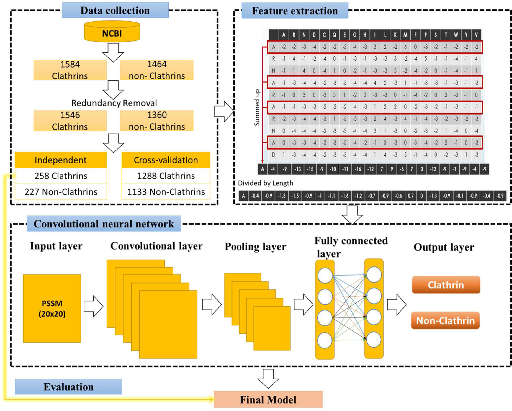

# Deep-Clathrin: Identification of clathrin proteins by incorporating hyperparameter optimization in deep learning and PSSM profiles

Description:
- clathrin_cnn.py: 2D CNN structure
- data: list all of the data used in the study
(for the new version, please use the "redundancy_100" data)

## Citation
Please cite our paper as:
>Le, N. Q. K., Huynh, T. T., Yapp, E. K. Y., & Yeh, H. Y. (2019). Identification of clathrin proteins by incorporating hyperparameter optimization in deep learning and PSSM profiles. *Computer Methods and Programs in Biomedicine*, 177, 81-88. https://doi.org/10.1016/j.cmpb.2019.05.016
